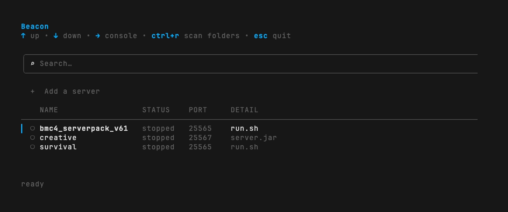
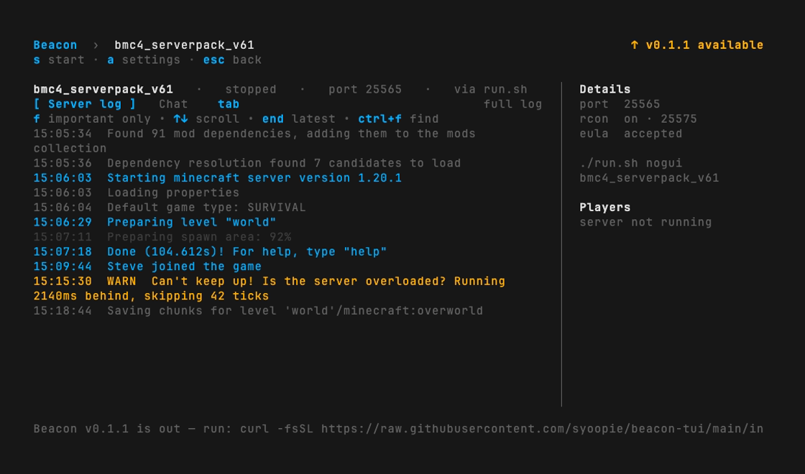
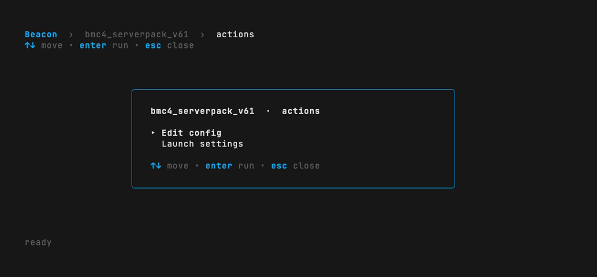
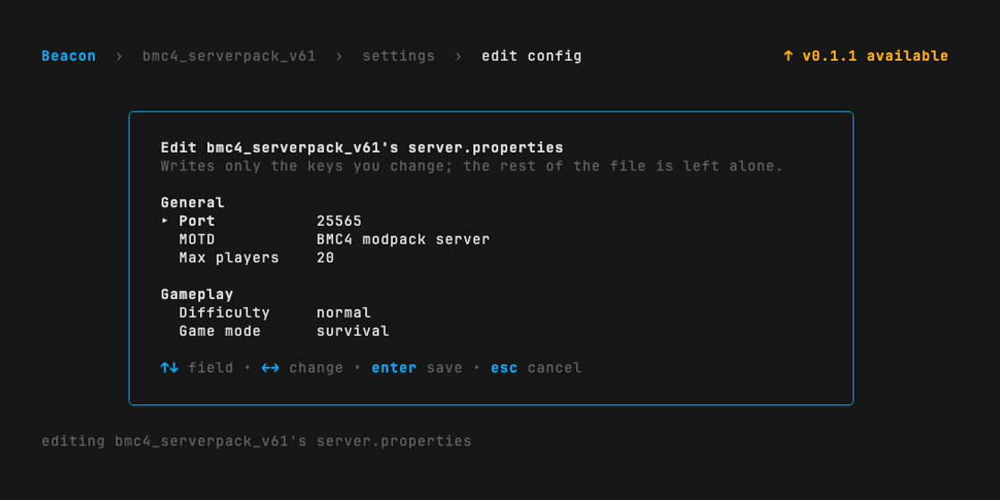

<h1 align="center">
  
</h1>

<p align="center">
Run your Minecraft servers from one clean terminal screen. Start them, stop
them, watch their logs, without losing track of what is running or leaving a
server half-dead.
</p>

<p align="center">
  <a href="https://github.com/syoopie/beacon-tui/actions/workflows/ci.yml"></a>
  <a href="https://github.com/syoopie/beacon-tui/releases"></a>
  <a href="LICENSE"></a>
</p>

## The list

Beacon opens here.



Running servers sort to the top. The dot after the port is green once players can
join, amber while the server is still opening it. Narrow terminals drop the
columns from the right.

## The console

`→` opens a server's console. Everything happens from there.



The rail carries the server's details always, and adds the player list plus live
memory and CPU while it runs.

## Actions

`a` opens the rest. Which rows appear depends on the server: a vanished one gets
Mark stopped, a broken start script gets Fix start script, and Edit config and
Launch settings are always there.



Edit config writes only the `server.properties` keys you change. Turning RCON on
here is what powers the player list.



## Why Beacon

- **Your servers stay up when you leave.** Beacon is just a control panel. Close
  it, log out, come back tomorrow. The servers keep running.
- **Nothing gets started twice.** Open Beacon in three windows if you like. It
  will not launch a second copy of a server or let two people fight over one.
- **Stops are safe.** Beacon asks the server to save and shut down, waits, and
  only offers a hard kill if it hangs. It never yanks the plug on its own.
- **It finds your servers for you.** Point it at a server's folder and it works
  out how to launch it, whether that is a `run.sh`, a Paper jar, or a Fabric jar.
- **One binary.** Download it and run. No daemon to keep alive, no database,
  nothing to configure.

## Install

```sh
curl -fsSL https://raw.githubusercontent.com/syoopie/beacon-tui/main/install.sh | bash
```

Beacon runs on macOS and Linux. The installer pulls in `tmux` if you do not have
it. Windows is not supported.

## Uninstall

Stop your servers from inside Beacon first, so nothing is left running under
tmux. Then:

```sh
# 1. the binary (wherever the installer put it)
rm -f "$(command -v beacon)"

# 2. settings and logs
rm -rf ~/.config/beacon ~/.local/state/beacon                  # Linux
rm -rf ~/Library/Application\ Support/beacon ~/.local/state/beacon   # macOS
```

That removes everything Beacon wrote. Your server folders, worlds, and jars are
yours and are never touched.

If a server is still running, Beacon left a `beacon-<id>` tmux session behind.
`tmux ls` lists them and `tmux kill-session -t beacon-<id>` stops one, which also
stops that server. The installer may have installed `tmux` itself; remove it with
your package manager if you want it gone.

## First run

Run `beacon`. It opens on a welcome screen because you have no servers yet.

1. Press `a` and browse to the folder your server lives in. No path typing.
2. It shows up in the list. Beacon has already worked out how to launch it.
3. Press `→` to open its console, then `s` to start it.

Point Beacon at a folder that holds several server folders and it picks up every
one. Add more later from the `+ Add a server` row, or press `ctrl+r` to re-scan.

**What the folder needs.** Beacon launches a server through a `run.sh`, a
`start.sh`, or a jar named `server.jar`, `paper-*.jar` or `fabric-server-*.jar`,
found in the folder you add or one level below it. A freshly downloaded modpack
ships an installer instead, so run the pack's own setup once first. For NeoForge
or Forge 1.17 and later, `java -jar <name>-installer.jar --installServer` (or the
pack's `startserver.sh`) writes the `run.sh` Beacon then finds. Paper, Fabric and
vanilla jars are already launchers. Older Forge packs, which produce only a
versioned `forge-<version>.jar` and ship a `ServerStart.sh`, are not detected
yet.

**Fix start script.** NeoForge and Forge write a `run.sh` that starts Java
without `exec`, which breaks stop and status. Beacon flags this on the list;
**Fix start script** in the actions overlay rewrites the one line and keeps your
original as `run.sh.bak`. Do it before the first start.

**Java.** Minecraft 1.20 needs Java 17, 1.21 needs Java 21, and the newest builds
need Java 25. By default Beacon runs a server with the `java` on your `PATH`.
When your packs need different versions, open the server's actions overlay,
choose Launch settings, and pick a Java runtime on the row under MC version.
Beacon lists the JDKs it finds on the host; `←→` cycles them. The choice is
per server, so each pack can run on its own JVM.

A pack that ships more than one launcher, such as a `run.sh` and a `start.sh`,
defaults to `run.sh`. Launch settings in the actions overlay switches that or
sets the arguments passed to it.

Beacon will not start a server whose `eula.txt` does not say `eula=true`. Accept
the Minecraft EULA in the actions overlay writes it once you agree to
<https://aka.ms/MinecraftEULA>.

## Keys

On the list:

| Key      | What it does                                       |
| -------- | ------------------------------------------------- |
| `↑` `↓`  | move the highlight                                |
| `→`      | open the server's console                         |
| type     | filter the list by name                          |
| `enter`  | on the `+ Add a server` row, pick a folder        |
| `ctrl+r` | re-scan your folders for new servers              |
| `esc`    | clear the search, or quit when it is already empty |

In the console:

| Key        | What it does                                                  |
| ---------- | ----------------------------------------------------------- |
| `↑` `↓`    | scroll the log                                              |
| `s`        | start, stop (after a confirm), or mark a vanished server stopped |
| `K`        | force-kill, offered only after a stop has hung              |
| `a`        | the actions overlay                                         |
| `c`        | type a command to a running server                          |
| `tab`      | switch between the server log and Chat                      |
| `f`        | full log, or important only (events, warnings, errors)      |
| `/`        | search the whole log, `esc` clears it                       |
| `←` `esc`  | back to the list                                            |

The list refreshes itself every second, so there is no refresh key. `ctrl+c`
quits from anywhere. Your servers keep running either way.

In the full log, event, warning and error lines are coloured and everything else
is dimmed, so a busy modded log still reads. Search looks through the whole log,
not just the current filter, until you clear it.

Next to the port, Beacon shows whether that port is accepting connections.
`starting` means the process is up but has not opened its port yet, the normal
state for the first half minute of a boot. `ready` means players can join. A
server that sits on `starting` while its log has gone quiet is wedged.

The rail's uptime, memory and CPU come from `ps` and need nothing configured; the
same numbers show in the server's row on the list. On a narrow terminal the
rail's facts fold into one line under the tab bar.

## Questions

**Where does Beacon keep things?** Settings live in `config.toml` under your
config folder (`~/Library/Application Support/beacon` on macOS, `~/.config/beacon`
on Linux). Logs live under `~/.local/state/beacon/logs`. You rarely need to touch
either.

**My server flips straight to `unknown` when I start it.** It started and then
exited on its own. The notice banner quotes the last line of its log, and the
full log is in the console. The usual cause is Java, either missing from `PATH`
or the wrong version for that pack (see [First run](#first-run)); set the right
one in Launch settings. The status reads `unknown` rather than `stopped` because
Beacon only knows the session ended, not that it ended on purpose. Press `s` to
mark it stopped once you have looked.

**Can I use it on a remote box?** Yes. Beacon is a local program with no network
of its own. However you already get a terminal on that machine (SSH, Tailscale,
sitting in front of it) is how you use Beacon.

**What is that `unknown` status?** Beacon knows a server was running, but its
session has vanished. It will not guess that the server is safely off, because
guessing wrong is how you get two servers fighting over one port. Check the box,
then open the console and press `s` to mark it stopped.

**Can I rename a server?** Not yet. The name is taken from the folder when you
add it, lowercased with odd characters turned to `-`.

**Does it keep itself updated?** It tells you when a new version is out and shows
the command to run. Updating is re-running the install line above.

<details>
<summary>Development</summary>

Requires Go 1.24+ and `tmux`.

```sh
git clone https://github.com/syoopie/beacon-tui
cd beacon-tui
make check        # gofmt, go vet, go test
make test-unix    # also runs the tmux integration tests
make run          # go run ./cmd/beacon
```

The tmux integration tests carry a `//go:build unix` tag and skip when `tmux` is
not on `PATH`. `make lint` runs golangci-lint if it is installed; CI always does.

**How it works**

- **tmux owns process lifetime and stdin.** Beacon launches each server through a
  shell that redirects output to a log file and `exec`s the command, so the pane
  process is the JVM itself. Sessions are named `beacon-<id>`.
- **Logs are plain files**, tailed from disk. The tailer reopens a log that is
  truncated or rotated. Beacon rotates the captured log itself once it passes
  10 MiB: it gzips a timestamped copy next to the live file, truncates the live
  file in place so the shell redirect keeps writing to it, and prunes the oldest
  archives once they total more than 450 MB.
- **Disk is the source of truth.** `config.toml` and `servers/<id>.toml` hold
  everything that matters. Every Beacon process reloads them each tick. Memory is
  a cache that goes stale until the next reconcile.
- **A host lock serializes every mutating operation** (start, stop, force-kill,
  import, script patch, config write, log rotation) across all Beacon processes. It is a
  PID-bearing lockfile with stale-holder recovery. Reads never take it.
- **Reconcile** compares recorded state against tmux on startup and on a ticker,
  and derives the status shown in the list.

**Package layout**

| Package                 | Responsibility                                    |
| ----------------------- | ------------------------------------------------- |
| `internal/config`       | dirs, TOML parse, atomic write                    |
| `internal/server`       | IDs, spec, the status state machine               |
| `internal/importdetect` | scan folders, detect scripts and jars, exec patch |
| `internal/supervisor`   | the `Supervisor` port                             |
| `internal/tmux`         | the tmux adapter, the only package that knows tmux |
| `internal/logtail`      | append-only log file follower, reopens on truncate |
| `internal/logrotate`    | copytruncate the captured log to gzip archives, prune to a size budget |
| `internal/reconcile`    | derive status from tmux, port collision and live port health checks |
| `internal/oplock`       | the host operation lock                           |
| `internal/lifecycle`    | start, stop, force-kill, config writes under the lock |
| `internal/mcprops`      | line-preserving editor for server.properties and eula.txt |
| `internal/rcon`         | poll a running server for its player list         |
| `internal/procstat`     | read a process's memory, CPU and uptime from `ps` |
| `internal/selfupdate`   | the startup release check                         |
| `internal/ui`           | the Bubble Tea front end                          |

**Cutting a release**

Releases are built by a manually triggered GitHub Actions workflow, not on every
push. In the **Actions** tab, run **Release** and pass a version such as `v0.1.0`.
It cross-compiles `darwin` and `linux` for `amd64` and `arm64`, publishes the
binaries with checksums, and tags the commit.

</details>
