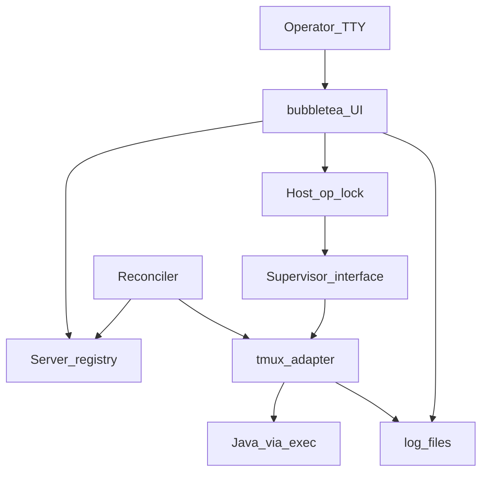

# Beacon TUI — implementation plan

The operator sits on a Mac or Linux box that already has the Minecraft trees. They run `beacon`, see every imported server, start and stop them safely, and (in a later phase of this same plan) type console commands. Windows is a compile machine only.

How you reach that box is outside the product. Any SSH (Tailscale, LAN, or otherwise) is the same to beacon. It is a local TUI. It does not dial SSH.

Dev helper only (not shipped behavior). Plan mode could not write non-markdown files. After you switch to agent mode, create `.gitignore`, `.env`, `.env.example`, and `scripts/ssh-host.ps1` from the **Dev SSH helper** section below. Fill `.env` yourself. Never commit `.env`.

Durable write-up after you approve: `[plans/01-beacon/](plans/01-beacon/)` (`overview.md` plus one file per phase). Source of product truth today: `[beacon-development-plan.md](beacon-development-plan.md)`. The repo has no Go code yet.

## Scope

**In.** Java servers found by `run.sh` / `start.sh` or typical jars (`server.jar`, `paper*.jar`, `fabric-server*.jar`). Config as source of truth. tmux for process lifetime only. Logs from redirected files. Reconcile on startup and on a tick. Host-wide lock for mutating operations. Start, graceful stop, force-kill after timeout. Console stdin. EULA prompt. `server.properties` editor and RCON mirror. Opportunistic RCON. CPU/RAM on the exec’d Java PID. TCP port probe.

**Out.** Windows runtime (keep a `Supervisor` interface so it can exist later). Bedrock. Docker wrappers. Per-user ACL / owner fields. Operations audit log. Any remote-access layer (Tailscale, jump hosts, `authorized_keys` `command=` auto-launch). Auto-accept EULA. Auto `tmux kill-session` on stop timeout.

**Settled with you.** macOS + Linux app. Shared viewer: every imported server is visible to anyone who can run the binary. First *usable* loop is list + logs + start/stop (console is the next phase, not a later product). Many `beacon` processes allowed. One mutating operation at a time. Force-kill only after the stop timeout. Import offers a confirmed `exec` patch. This plan is the host TUI. SSH is how a human gets a tty, not something beacon implements.

## Second process (your question)

Yes. They already share everything that matters: `servers/*.toml`, log files, tmux session names, bind ports. Nothing important lives only in RAM. Each process loads config, reconciles against tmux, and tails the same files. RAM is a cache. It goes stale until the next reconcile.

What they must not share without a lock is **writes**: start, stop, force-kill, import, script patch, config save. Use a PID-bearing lockfile under the state dir, with stale-lock recovery if the holder is dead. Log tail and list refresh stay unlocked. If you lock those too, the second viewer freezes for a 60s stop.

## Constraints

- Runtime: macOS and Linux. tmux and a POSIX shell on PATH. Java is the server’s problem, not beacon’s, except PID tracking. No SSH client, no Tailscale API, no listen-on-the-network requirement beyond the Minecraft ports the servers already bind.
- You can keep developing on Windows. Prove tmux and the TUI on the Mac over SSH (`scripts/ssh-host.ps1`), or in WSL2 if you want Unix tests without the Mac. Native Windows cannot prove Phase 4+.
- Config dir: `os.UserConfigDir()/beacon` (`~/.config/beacon` on Linux, `~/Library/Application Support/beacon` on macOS). State: `os.UserStateDir()` if available, else XDG `~/.local/state/beacon` / equivalent. Do not hard-code `~/.config` on Darwin.
- Launch strings are quoted at the boundary. Config and `server.properties` are parsed into types once; the rest of the program trusts those types.
- Start is idempotent: if the tmux session exists, attach, do not launch a second Java.

## Domain model

Status is a state machine. Force-kill is a derived flag, not a status:

```text
Stopped -> Starting -> Running -> Stopping -> Stopped
                 \                    ^
                  \-> Unknown (session missing, last_known was running)
```

`forceKillAllowed` is true only while status is Stopping and the timeout has elapsed. Unknown refuses Start (that is how you get a port collision). From Unknown the operator marks Stopped (session already gone) or inspects the host. No silent downgrade to Stopped.

Core records (names, not code):

- `ServerID` branded string from directory name, collision suffix `-2`.
- `ServerSpec` from TOML: id, path, start command, port, tmux session, log path, rcon block.
- `ServerRuntime` ephemeral: pid, status, last reconcile, lock holder. Never the source of truth.
- `ReconcileReport` per server: session exists, last_known, derived status, user-visible warning.
- `OpKind` start | stop | forceKill | import | patchScript | writeConfig. All take the host lock.

`[state]` in TOML is written only under that lock. Treat it as a cache for the next boot, not as truth versus tmux.

## Architecture




tmux’s job is session + stdin (`send-keys`). Logs are files. Prefer generated start scripts whose last line is `exec java ...` so the pane PID is Java.

## Alternatives (why tmux anyway)

- **systemd user units.** Better on Linux, weak on a Mac sitting on someone’s desk, no stdin story as clean as a pane.
- **Docker per server.** Different product. Out of scope.
- **tmux + log files (chosen).** Matches the draft, works on Mac and Linux, stdin is already there.

Keep `Supervisor` as the interface. `tmux` is the first adapter. A future Windows adapter would not rewrite the registry or UI.

## Phases

Each phase is independently shippable. Static check for all of them: `go test ./...`, `go vet ./...`, and the project linter once it exists. Runtime check is named per phase. Two to three packages per phase. Order is scaffold and types first.

1. **[Scaffold](plans/01-beacon/phase-1-scaffold.md)** — `go mod`, `cmd/beacon`, Makefile, CI on Linux and macOS, `internal/paths` for config/state dirs. Verify: binary prints version and exits 0.
2. **[Config and domain](plans/01-beacon/phase-2-config.md)** — TOML schema, parse at the boundary, `ServerSpec` / status enum, round-trip tests, golden files under `testdata/`. Verify: load a fixture tree, reject illegal status strings.
3. **[Import and exec patch](plans/01-beacon/phase-3-import.md)** — Scan roots from `config.toml`. Detect scripts/jars. Derive id. Write `servers/<id>.toml`. If the start script’s last command is not `exec`, show the one-line diff and patch only on confirm. Backup `run.sh.bak`. Refuse launch later if still wrong. Verify: fixture dirs (vanilla script, paper jar, missing exec, collision names).
4. **[Supervisor and log files](plans/01-beacon/phase-4-supervisor.md)** — Interface: create session, check exists, send keys, kill session. Launch with shell redirect of stdout/stderr to `log_file` (`exec` last). Do not use `pipe-pane` as the log source (it drops early JVM lines and ties logs to the pane). File tailer reopens on truncation. Tests use a stub (`sh -c 'echo boot; exec sleep 30'`), not Minecraft. Verify on the Mac (SSH) or WSL: session lives after beacon would have exited.
5. **[Reconcile and ports](plans/01-beacon/phase-5-reconcile.md)** — Startup + ticker. Session present → Running. Session absent + last_known running → Unknown, never silent Stopped. Port check: OS listeners and other specs with the same port before start. Verify: kill beacon, leave tmux up, restart beacon, no second bind.
6. **[Lock, start, stop, force-kill](plans/01-beacon/phase-6-lifecycle.md)** — Lockfile. Hold the lock for the whole mutating op, including the stop wait, so a second start cannot sneak in. Start is no-op if the session exists. Start is an error if status is Unknown. Stop sends `stop` newline, polls log and Java PID, default 60s. After timeout, surface force-kill; do not kill by yourself. Force-kill is `tmux kill-session`. Config writes are temp-file plus rename. Verify: stub that exits on `stop`; stub that ignores `stop` until force-kill; two processes, second start returns “op in progress”.
7. **[TUI: list, status, logs, start/stop](plans/01-beacon/phase-7-tui.md)** — Bubble Tea. Server list, derived status, log viewport, start/stop/force-kill when allowed. Shared viewer: no login. Verify: drive the TUI (or a headless model test plus one real terminal run) through import → start → log lines appear → stop.
8. **[Console stdin](plans/01-beacon/phase-8-console.md)** — Input bar. `send-keys` under the same lock as other ops. Verify: stub echoes stdin to the log file; TUI command shows up there.
9. **[EULA and properties](plans/01-beacon/phase-9-eula-props.md)** — Missing/false `eula.txt` blocks start with an explicit accept. Editor for port, MOTD, difficulty, max-players, `enable-rcon`, `rcon.password`. Toggling RCON copies into the spec’s `[rcon]` table. Verify: refuse start on eula false; accept writes `eula=true`; properties round-trip.
10. **[RCON, metrics, TCP health](plans/01-beacon/phase-10-rcon-metrics.md)** — RCON only when enabled and up, for structured commands (`list`). Else stdin. CPU/RAM from the Java PID (the exec’d one). TCP connect to `port` as a separate health bit. Verify: fake RCON listener in tests; a hung stub that holds a PID but does not accept TCP.

**Later, not this plan.** Windows supervisor, ops log, ACL. A force-command jump-app only if you later want SSH to skip the shell and land in beacon. That is optional convenience, not required for remote use.

## Package layout

Fewer packages than the first draft. A second Supervisor adapter is not real yet, so do not invent `internal/process` for one implementation.

- `[cmd/beacon](cmd/beacon)` — `main`, `--config-dir` for tests.
- `[internal/config](internal/config)` — dirs, TOML parse/serialize, atomic write, 0600 on files that can hold RCON passwords.
- `[internal/server](internal/server)` — IDs, spec, status, registry.
- `[internal/importdetect](internal/importdetect)` — scan, exec check, patch.
- `[internal/tmux](internal/tmux)` — session, redirect, send-keys, tail.
- `[internal/reconcile](internal/reconcile)`
- `[internal/oplock](internal/oplock)`
- `[internal/lifecycle](internal/lifecycle)` — start/stop/force-kill.
- `[internal/ui](internal/ui)`
- `[internal/mcprops](internal/mcprops)` — eula + properties.
- `[internal/rcon](internal/rcon)` and `[internal/metrics](internal/metrics)` — only when Phase 10 starts. Do not create empty packages in Phase 1.

## Verification (project)

- `go test ./...` on Linux CI. macOS CI is optional. Integration tests are `unix` tagged and skip if `tmux` is missing.
- Headless tests own the domain. Prove tmux and the TUI on the Mac over SSH, or in WSL.
- Do not call Phase 7 done from unit tests alone. Watch log lines from a stub in the running TUI. A real Minecraft jar is not a Phase 7 requirement (EULA is Phase 9). Stubs until then.
- First-run needs a configured scan root. Empty config is a prompt or a flag, not a home-directory crawl.

## Implementation guidance

- **how** before changing tmux/Bubble Tea/RCON if the implementer does not already know the subsystem.
- **interrogate** before shipping the status machine and the lock (those two are easy to get subtly wrong).
- `/deslop` before each commit. **unslop** on README and plan files.
- **show-me-your-work** for lock + reconcile decisions.
- **babysit** after the first PR.
- CLI/TUI surface: Claude **run** skill (or equivalent). No browser **verify**.
- Comments only for non-obvious why. No phase banners in test files.

## Defaults you did not have to pick

- Stop timeout 60s, overridable in `config.toml`.
- Scan roots start as a single configured directory, not a full-home crawl.
- `server-id` from directory name.
- RCON off until properties say otherwise.

## Throughput checkpoint

Ten phases, each with `go test` plus a Unix runtime check. Reconcile and the op lock are the load-bearing ones. If those slip, later UI is theater.

## Plan review (binding)

These were gaps in the first comprehensive draft. They are now constraints, not nits.

**Status vs force-kill.** A `ForceKillAvailable` state duplicates Stopping and breaks “one status”. Keep Stopping. Derive the keybind from timeout.

**Unknown and Start.** Reconcile-to-Unknown exists to prevent double-launch. Allowing Start from Unknown undoes that. Refuse Start until the operator marks Stopped.

**Logs.** `pipe-pane` is the failure mode the original draft already rejected for `capture-pane`. Redirect at launch.

**Lock duration.** One mutating op at a time means the lock covers the 60s stop poll. Reads (tail, list) stay free. Second Start gets “op in progress”, not a second Java.

**Torn config.** Two processes plus a reconcile ticker will write `last_known`. Atomic rename under the op lock. Without that, the lockfile is theater.

**Secrets.** RCON password in TOML is plaintext. 0600 on server files. Do not log the password. No OS keychain in this plan.

**EULA vs TUI.** Phase 7 cannot use a real server that has never been accepted. Stubs prove the TUI. Phase 9 is the first honest Minecraft boot.

**send-keys.** Console input still needs tmux literal / escaped send so a line cannot become extra keys. Secondary to launch-string quoting, still Phase 8 work.

**Log growth.** No rotator in this plan. Redirected files grow until the operator truncates. Say so in the UI later if it hurts. Do not build logrotate.

**First run.** Scan root is required config. Do not invent a default of `$HOME`.

**Module path.** Use a local module path (`beacon-tui`) until there is a real import path. Do not fake a GitHub module.

**CI.** Linux is enough to compile and run non-tmux tests. The Mac via SSH is the tmux proof. Paid macOS CI is not required to start.

**tmux names.** Prefix `beacon-` as in the draft so user sessions are not mistaken for servers.

**Phase 1 empty packages.** Do not scaffold rcon/metrics directories before Phase 10.

## Dev SSH helper

Key auth only. OpenSSH prompts for a key passphrase. There is no `SSH_PASSWORD`.

`.gitignore` contains a single line, `.env`.

`.env` and `.env.example` use the same placeholders:

```
SSH_HOST=
SSH_USER=
SSH_PORT=22
SSH_IDENTITY_FILE=
SSH_REMOTE_COMMAND=
```

`SSH_HOST` is the Mac as you reach it. `SSH_IDENTITY_FILE` is a Windows path to a private key. Leave `SSH_REMOTE_COMMAND` empty for an interactive shell.

`scripts/ssh-host.ps1` loads that file without executing values, requires the three identity fields, and runs `ssh -i -p` with `IdentitiesOnly=yes`. Extra args become the remote command. Switch to agent mode to have these files created in the repo.